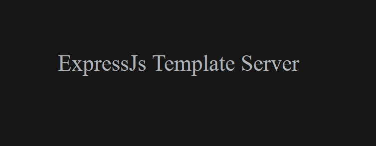
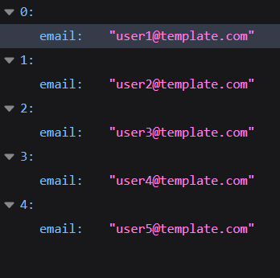

# About
This is a ready to use ExpressJs server template with a Postgres database

## Create the DB
1. Start postgres with the command `startpostgres` (make sure you have postgres installed in the device chosen to run this app)
2. Create a database: from your terminal run the command `psql` then `CREATE DATABASE iraj_coding_challenge;`. If you with to use a deferent name for your database go to the file .env and change the database to whatever you like.

## Setup
1. Install server dependencies using the `npm install` command.
3. run the command `npm run db:reset` to create the tables and insert data into the database. This command is also used to reset the database back to it's original state.
3. Start the web server using the `npm start` command. The app will be served at <http://localhost:8000/>. To run this app using nodemon use the command: `npm run local`

## Routes
- The home route <http://localhost:8000/> will display a text on the browser with the tittle of this app

- The debug route <http://localhost:8000/debug> will display a list of all emails saved in the database

